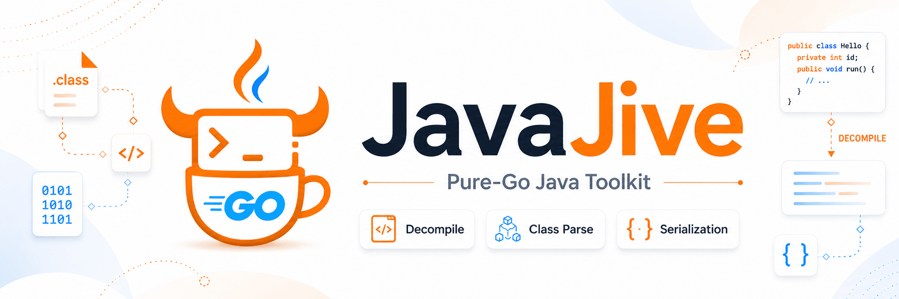

<p align="center">
  
</p>

# JavaJive

[](https://github.com/yaklang/javajive/actions/workflows/ci.yml)
[](https://github.com/yaklang/javajive/actions/workflows/deploy-pages.yml)
[](https://pkg.go.dev/github.com/yaklang/javajive)
[](LICENSE)

**English** | [简体中文](README.zh-CN.md) | [Website](https://yaklang.io/javajive/)

A portable, **pure-Go** Java toolkit — extracted and trimmed from
[yaklang](https://github.com/yaklang/yaklang) — that does three things and
nothing else:

- **Decompile** — `.class` / `.jar` / `.war` / `.zip` → readable Java source.
- **Parse classes** — inspect the structure of a `.class` file (constant pool,
  fields, methods, version, access flags).
- **(De)serialize** — parse and re-marshal the Java serialization (ObjectStream)
  wire format with byte fidelity, and convert it to/from JSON.

Built for portability and embedding:

- **Pure Go, single binary** — **no JDK, no cgo, no ANTLR runtime**, no native
  libraries. Cross-compiles to linux / macOS / windows on amd64 and arm64.
- **One import** — a unified `javajive` facade package wraps all three
  capabilities; the sub-packages remain available for advanced use.
- **First-class CLI** — `decompile`, `classinfo`, and `serial` subcommands,
  built on the standard library.
- **Cross-tested against a real JDK** — CI compiles real `.class` / `.jar` and
  JDK-serialized blobs with `javac`/`java`, then verifies JavaJive against them
  (see [HARNESS-WORKFLOW.md](HARNESS-WORKFLOW.md)).
- **Trimmed dependency graph** — `utils` / `codec` / `log` / `go-funk` are
  reimplemented as a minimal, self-contained `internal/` core.

## Benchmarks

Measured on 8 real-world jars (2,252 outer classes) via decompile → `javac --release 8`
recompile → repackage → JVM verify:

- **96.2% class-clean rate** — 2,167 / 2,252 outer classes recompile with **zero `javac`
  errors**, and **0 syntax errors** across all 8 jars (a CI-enforced hard assertion, so no
  type error can hide behind a lexer failure).
- **commons-codec & gson fully round-trip** — decompile → recompile → repackage → external
  JVM `-Xverify:all` per-class verification passes end-to-end (codec is byte-identical to the
  original jar under a call differential).
- **5 / 5 self-hosted algorithms** (MD5 · SHA-256 · CRC32 · quicksort · Base64) round-trip
  **byte-for-byte**.
- **#1 in a fair 3-way comparison** — clean-class rate 96.2% vs Vineflower 1.10.1 (90.8%) and
  CFR 0.152 (79.7%); 85 defective classes vs CFR's 457 (**81% fewer**) and Vineflower's 208
  (**59% fewer**), winning all 8 jars against CFR.

See [BENCHMARK.md](BENCHMARK.md) for the full methodology, per-jar tables and reproduction commands.

## Install

```bash
# CLI
go install github.com/yaklang/javajive/cmd/javajive@latest

# Library
go get github.com/yaklang/javajive@latest
```

Or build from source:

```bash
git clone https://github.com/yaklang/javajive
cd javajive
go build -o javajive ./cmd/javajive
```

Requires Go 1.22+.

## CLI

```text
javajive <command> [arguments]

Commands:
  decompile   decompile .class/.jar/.war/.zip or a directory into Java source
  classinfo   print the structure of a .class file (version, fields, methods)
  serial      Java serialization tools (subcommands: tojson, fromjson)
  version     print the version
  help        show help
```

### decompile

```bash
# Single class: prints to stdout by default, or -o to write a file.
javajive decompile Foo.class
javajive decompile Foo.class -o Foo.java

# Archive: defaults to a "<input>.src" directory, or -o to choose one.
javajive decompile app.jar
javajive decompile app.war -o ./app-src

# Directory: recursively decompile .class files (requires -o output dir).
javajive decompile ./classes -o ./src
```

### classinfo

```bash
javajive classinfo Foo.class
```

```text
class:      InvisibleAnnoSeed
super:      java/lang/Object
version:    61.0
access:     public
constants:  18

fields (0):

methods (2):
   <init>()V
   run()I
```

### serial

```bash
# Serialized binary -> JSON. (-hex: input is a hex string, -: read from stdin)
javajive serial tojson dump.bin
printf 'aced000574000568656c6c6f' | javajive serial tojson -hex -

# JSON -> serialized binary. (default prints hex; with -o writes raw bytes)
javajive serial fromjson dump.json -o out.bin
javajive serial fromjson dump.json          # prints hex
```

## Library

Use the unified facade package — one import covers all three capabilities:

```go
import "github.com/yaklang/javajive"

// Decompile a single class, or a whole archive into a directory.
src, err := javajive.Decompile(classBytes)
err = javajive.DecompileArchive("app.jar", "app-src")

// Inspect class structure.
obj, err := javajive.ParseClass(classBytes)
_ = obj.GetClassName()

// Java serialization: binary -> JSON -> binary.
objs, _ := javajive.ParseSerialized(raw)          // or ParseSerializedHex(hexStr)
jsonBytes, _ := javajive.SerializedToJSON(objs...)
restored, _ := javajive.SerializedFromJSON(jsonBytes)
out := javajive.MarshalSerialized(restored...)
```

### Unified API

| Function | Purpose |
|---|---|
| `Decompile(classBytes) (string, error)` | Decompile one `.class`'s bytes |
| `DecompileFile(path) (string, error)` | Decompile one `.class` from disk |
| `DecompileWithResolver(classBytes, resolve)` | Decompile with a class-bytes resolver |
| `DecompileArchive(src, dst) error` | Decompile a `.jar`/`.war`/`.zip` into a directory |
| `ParseClass(classBytes) (*ClassObject, error)` | Parse one `.class`'s bytes |
| `ParseClassFile(path) (*ClassObject, error)` | Parse one `.class` from disk |
| `ParseSerialized(raw) ([]JavaSerializable, error)` | Parse a serialization stream |
| `ParseSerializedHex(hexStr) ([]JavaSerializable, error)` | Parse a hex-encoded stream |
| `MarshalSerialized(objs...) []byte` | Re-encode objects to the wire format |
| `MarshalSerializedHex(objs...) string` | Re-encode to hex |
| `SerializedToJSON(objs...) ([]byte, error)` | Convert objects to JSON |
| `SerializedFromJSON(raw) ([]JavaSerializable, error)` | Rebuild objects from JSON |

The sub-packages are also exported for advanced use:
`classparser`, `classparser/jarwar`, `serialization`.

## Differences from upstream yaklang

To stay portable and small, JavaJive makes a few deliberate trade-offs versus
yaklang. See [MIGRATE.md](MIGRATE.md) for the full mapping and migration guide.

| Area | yaklang (upstream) | JavaJive |
|---|---|---|
| Decompiler ANTLR safety net | re-validates dumped source via an ANTLR Java grammar; degrades members to stubs on failure | removed (heavy dependency); validation is a no-op, output is emitted directly |
| Support layer (`utils` / `codec` / `log` / `go-funk`) | shared monorepo packages | minimal self-contained re-implementations under `internal/` |
| `yso` gadget generator | included | not included |
| String literal charset recovery (`MatchMIMEType`) | optional GBK/GB18030 recovery | stubbed (no-op); behaviour unchanged for the vast majority of cases |

Third-party dependencies are confined to a small set of pure-Go libraries
(`gobwas/glob`, `go-viper/mapstructure`, `samber/lo`, `tidwall/gjson`,
`segmentio/ksuid`, `yeka/zip`, and a few `golang.org/x/*`).

## Testing

```bash
go test ./...                 # unit tests + JDK cross-tests (skipped if no JDK)
go test ./... -race           # data-race free (linux)
go test ./test/cross/ -v      # Java cross-tests only (needs javac/java on PATH)
```

The JDK cross-tests compile real Java artifacts at test time and verify them
against JavaJive; they `t.Skip` automatically when no JDK is present. See
[HARNESS-WORKFLOW.md](HARNESS-WORKFLOW.md) for how the harness and CI work.

## Project layout

```text
javajive.go      unified facade package (import "github.com/yaklang/javajive")
serialization/   Java serialization/deserialization (from yaklang common/yserx)
classparser/     class parser + decompiler (from yaklang common/javaclassparser)
cmd/javajive/    CLI entry point
internal/        trimmed self-contained support layer (log / codec / funk / utils / filesys / ...)
test/cross/      JDK-backed cross-tests (javac/java)
site/            static landing page deployed to GitHub Pages
```

## License

[MIT](LICENSE) © 2026 VillanCh. JavaJive is derived from
[yaklang](https://github.com/yaklang/yaklang).
