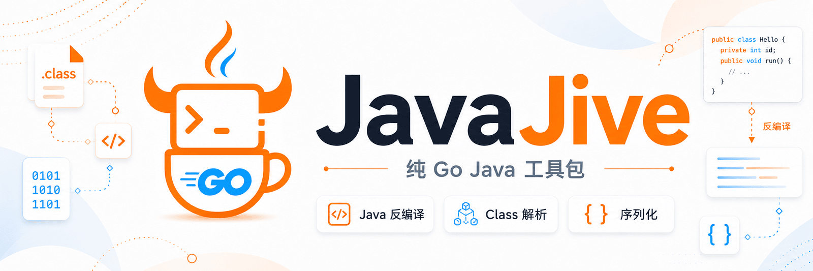

<p align="center">
  
</p>

# JavaJive

[](https://github.com/yaklang/javajive/actions/workflows/ci.yml)
[](https://github.com/yaklang/javajive/actions/workflows/deploy-pages.yml)
[](https://pkg.go.dev/github.com/yaklang/javajive)
[](LICENSE)

[English](README.md) | **简体中文** | [官网](https://yaklang.io/javajive/)

便携、**纯 Go** 的 Java 工具链——从 [yaklang](https://github.com/yaklang/yaklang)
抽取并裁剪而来，只专注三件事：

- **反编译**：`.class` / `.jar` / `.war` / `.zip` → 可读的 Java 源码。
- **Class 解析**：解析 class 文件结构（常量池、字段、方法、版本、访问标志）。
- **序列化**：以字节级保真解析与重组 Java 序列化（ObjectStream）二进制，并可与 JSON 互转。

为便携与嵌入而设计：

- **纯 Go、单一二进制**：**无需 JDK、无 cgo、无 ANTLR 运行时**、无原生库。可交叉编译到
  linux / macOS / windows 的 amd64 与 arm64。
- **一个 import**：统一门面包 `javajive` 聚合三类能力；子包仍可用于高级用法。
- **一流的命令行**：`decompile`、`classinfo`、`serial` 子命令，基于标准库实现。
- **与真实 JDK 交叉测试**：CI 用 `javac`/`java` 编译真实 `.class` / `.jar` 与 JDK 序列化字节，
  再用 JavaJive 验证（见 [HARNESS-WORKFLOW.md](HARNESS-WORKFLOW.md)）。
- **收敛的依赖图**：`utils` / `codec` / `log` / `go-funk` 被重写为 `internal/` 下最小自包含实现。

## 评测（Benchmark）

在 8 个真实流行 jar（2,252 个顶层类）上，走「反编译 → `javac --release 8` 重编译 → 重打包 → JVM 校验」：

- **类级干净率 93.6%** —— 2,107 / 2,252 个顶层类**零 `javac` 错误**可重编译，且全 8 jar **语法错为 0**
  （CI 硬断言把关，任何类型错都无法被词法错遮蔽）。
- **commons-codec 与 gson 完整往返** —— 反编译 → 重编译 → 重打包 → 外部 JVM `-Xverify:all` 逐类校验全通过
  （codec 经调用差分与原始 jar 逐字节一致）。
- **5 / 5 自托管算法**（MD5 · SHA-256 · CRC32 · 快排 · Base64）往返**逐字节一致**。
- **三方横评第一** —— 类级干净率 93.6%，高于 Vineflower 1.10.1（90.8%）与 CFR 0.152（79.7%）；缺陷类 145，
  比 CFR 的 457 **少 68%**、比 Vineflower 的 208 **少 30%**，且对 CFR 8 个 jar 全胜。

完整方法学、逐 jar 表格与复现命令见 [BENCHMARK.md](BENCHMARK.md)。

## 安装

```bash
# 命令行
go install github.com/yaklang/javajive/cmd/javajive@latest

# 作为库
go get github.com/yaklang/javajive@latest
```

或从源码构建：

```bash
git clone https://github.com/yaklang/javajive
cd javajive
go build -o javajive ./cmd/javajive
```

需要 Go 1.22+。

## 命令行

```text
javajive <command> [arguments]

Commands:
  decompile   反编译 .class/.jar/.war/.zip 或目录为 Java 源码
  classinfo   打印 .class 文件结构（版本、字段、方法）
  serial      Java 序列化工具（子命令：tojson、fromjson）
  version     打印版本
  help        显示帮助
```

### decompile

```bash
# 单个 class：默认输出到 stdout，可用 -o 写文件
javajive decompile Foo.class
javajive decompile Foo.class -o Foo.java

# 归档：默认输出到 "<输入>.src" 目录，可用 -o 指定
javajive decompile app.jar
javajive decompile app.war -o ./app-src

# 目录：递归反编译其中的 .class（必须用 -o 指定输出目录）
javajive decompile ./classes -o ./src
```

### classinfo

```bash
javajive classinfo Foo.class
```

```text
class:      InvisibleAnnoSeed
super:      java/lang/Object
version:    61.0
access:     public
constants:  18

fields (0):

methods (2):
   <init>()V
   run()I
```

### serial

```bash
# 序列化二进制 → JSON（-hex 表示输入是十六进制字符串，- 表示从 stdin 读取）
javajive serial tojson dump.bin
printf 'aced000574000568656c6c6f' | javajive serial tojson -hex -

# JSON → 序列化二进制（默认输出 hex；-o 写文件时输出原始字节）
javajive serial fromjson dump.json -o out.bin
javajive serial fromjson dump.json          # 打印 hex
```

## 作为库使用

推荐使用统一门面包，一个 import 即可覆盖三类能力：

```go
import "github.com/yaklang/javajive"

// 反编译单个 class，或把整个归档反编译到目录
src, err := javajive.Decompile(classBytes)
err = javajive.DecompileArchive("app.jar", "app-src")

// 解析 class 结构
obj, err := javajive.ParseClass(classBytes)
_ = obj.GetClassName()

// 序列化：二进制 → JSON → 二进制
objs, _ := javajive.ParseSerialized(raw)          // 或 ParseSerializedHex(hexStr)
jsonBytes, _ := javajive.SerializedToJSON(objs...)
restored, _ := javajive.SerializedFromJSON(jsonBytes)
out := javajive.MarshalSerialized(restored...)
```

### 统一接口

| 函数 | 作用 |
|---|---|
| `Decompile(classBytes) (string, error)` | 反编译单个 `.class` 字节 |
| `DecompileFile(path) (string, error)` | 从磁盘反编译单个 `.class` |
| `DecompileWithResolver(classBytes, resolve)` | 带「类字节解析器」的反编译 |
| `DecompileArchive(src, dst) error` | 将 `.jar`/`.war`/`.zip` 反编译到目录 |
| `ParseClass(classBytes) (*ClassObject, error)` | 解析单个 `.class` 字节 |
| `ParseClassFile(path) (*ClassObject, error)` | 从磁盘解析单个 `.class` |
| `ParseSerialized(raw) ([]JavaSerializable, error)` | 解析序列化流 |
| `ParseSerializedHex(hexStr) ([]JavaSerializable, error)` | 解析十六进制编码的流 |
| `MarshalSerialized(objs...) []byte` | 将对象重新编码为线格式 |
| `MarshalSerializedHex(objs...) string` | 重新编码为十六进制 |
| `SerializedToJSON(objs...) ([]byte, error)` | 对象 → JSON |
| `SerializedFromJSON(raw) ([]JavaSerializable, error)` | JSON → 对象 |

也可直接使用子包（高级用法）：`classparser`、`classparser/jarwar`、`serialization`。

## 与上游 yaklang 的差异

为保持便携与精简，相对 yaklang 上游做了取舍。完整映射与迁移指南见
[MIGRATE.md](MIGRATE.md)。

| 方面 | yaklang（上游） | JavaJive |
|---|---|---|
| 反编译器 ANTLR 安全网 | 用 ANTLR Java 语法对生成源码二次校验，失败时把成员降级为桩 | 移除（重量级依赖）；校验改为 no-op，直接输出结果 |
| 支撑层（`utils`/`codec`/`log`/`go-funk`） | 共享 monorepo 包 | `internal/` 下最小自包含实现 |
| `yso` gadget 生成器 | 包含 | 不包含 |
| 字符串字面量字符集恢复（`MatchMIMEType`） | 可选 GBK/GB18030 恢复 | 降级为 no-op（绝大多数场景行为不变） |

第三方依赖被收敛到一小组纯 Go 库（`gobwas/glob`、`go-viper/mapstructure`、
`samber/lo`、`tidwall/gjson`、`segmentio/ksuid`、`yeka/zip` 及若干 `golang.org/x/*`）。

## 测试

```bash
go test ./...                 # 单元测试 + JDK 交叉测试（无 JDK 时自动跳过）
go test ./... -race           # 无数据竞争（linux）
go test ./test/cross/ -v      # 仅 Java 交叉测试（需 PATH 上有 javac/java）
```

JDK 交叉测试会在测试时编译真实 Java 产物并用 JavaJive 验证；无 JDK 时自动 `t.Skip`。
harness 与 CI 的工作方式见 [HARNESS-WORKFLOW.md](HARNESS-WORKFLOW.md)。

## 包结构

```text
javajive.go      统一门面包（import "github.com/yaklang/javajive"）
serialization/   Java 序列化/反序列化（源自 yaklang common/yserx）
classparser/     class 解析与反编译器（源自 yaklang common/javaclassparser）
cmd/javajive/    命令行入口
internal/        裁剪后的自包含支撑层（log / codec / funk / utils / filesys / ...）
test/cross/      基于 JDK 的交叉测试（javac/java）
site/            部署到 GitHub Pages 的静态落地页
```

## 许可

[MIT](LICENSE) © 2026 VillanCh。JavaJive 衍生自
[yaklang](https://github.com/yaklang/yaklang)。
